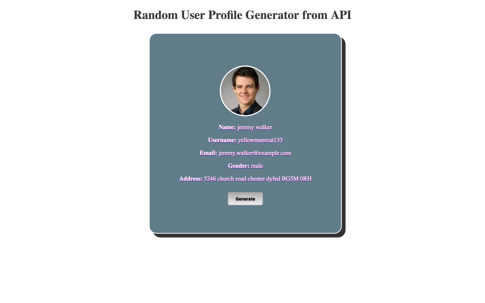

# Random-User-Profile-Generator
Created a profile generator from API using jQuery Ajax and ES 2017’s ‘Async function’ and ‘await’ keyword

## Prerequisites
Yarn or npm

## Getting Started
Download the files, run npm or yarn install, it will install the dependencies. Once dependencies are installed run gulp watch to start browserify,
you can then make changes to files in src and see the compiled code in dist files

## Screenshots
 

## How to Use?
Click on generate button to generate new profile.

## Built With
  - [Gulp.js](https://gulpjs.com/) - The task manager
  - [Yarn](https://yarnpkg.com/en/) - The package manager
  - [Webpack](https://webpack.js.org/) - The module bundler
  - [Babel](https://webpack.js.org/) - The compiler to write latest JavaScript
